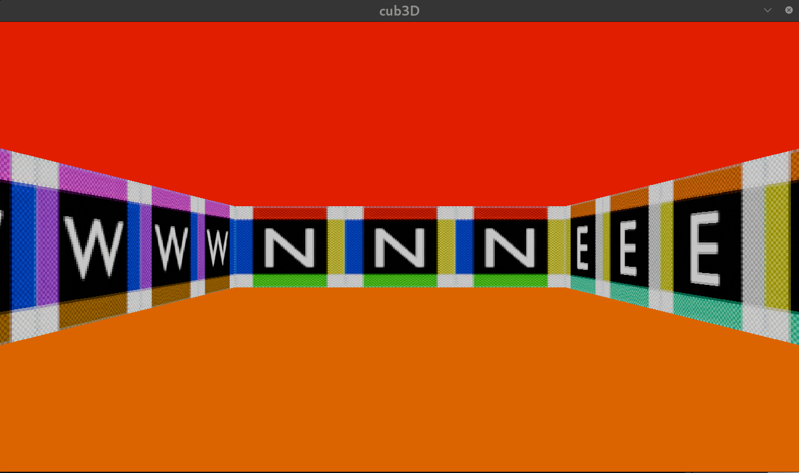
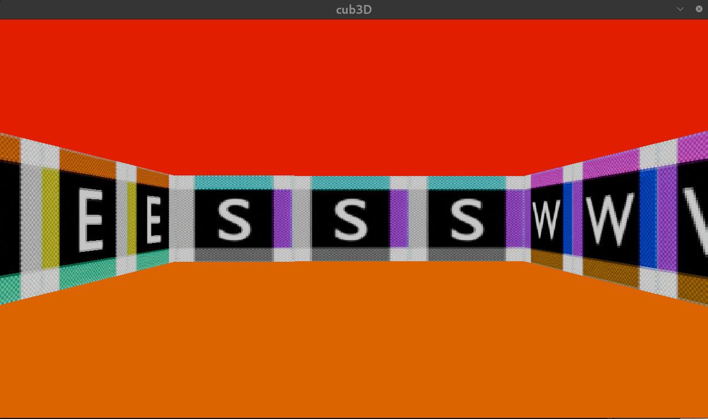
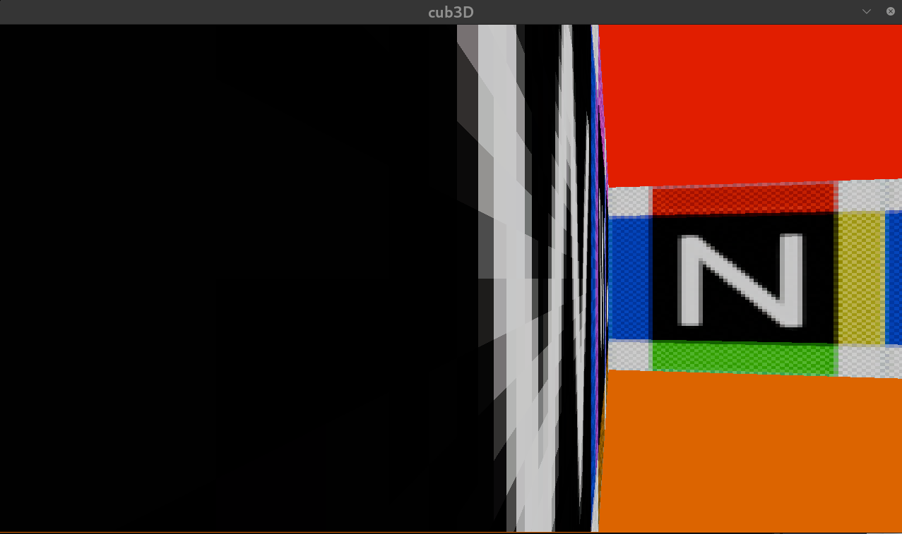
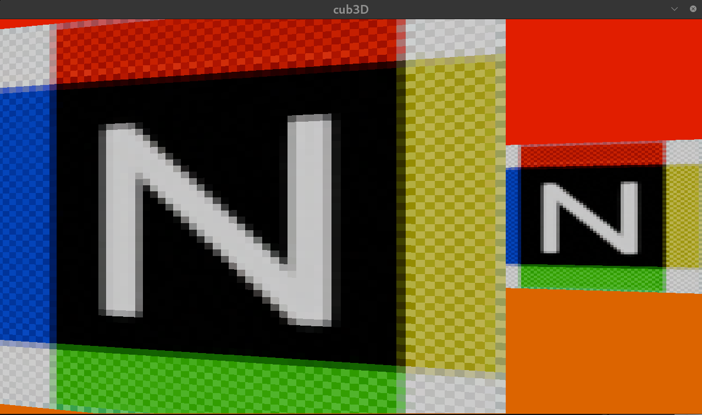
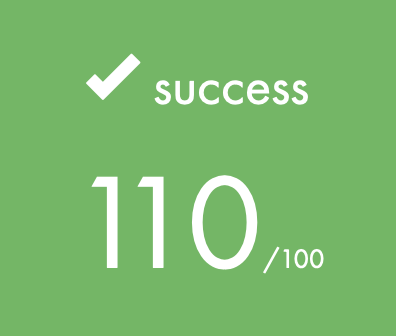

# 🚀 INTRODUCTION

---

The `cub3D` project at 42 school plunges students into the captivating realm of raycasting and 3D graphics rendering within the C language. This immersive endeavor challenges students to develop a rudimentary 3D game engine capable of rendering a textured maze in a two-dimensional plane.

Drawing inspiration from the iconic game Wolfenstein 3D, cub3D involves implementing raycasting techniques to simulate the rendering of three-dimensional environments in real-time. Students delve into the intricacies of vector mathematics, spatial geometry, and rendering algorithms to construct a visually compelling game world.

Beyond graphics rendering, the project delves into file parsing, user input handling, and interactive gameplay mechanics.

`cub3D` serves as a springboard for exploring the fusion of computer graphics and game development, empowering students to craft immersive experiences that push the boundaries of visual storytelling and interactive entertainment.


# 🛠️  Program Specificities and Considerations

> [!WARNING]
> This project aims to be executed in a x86 Linux environment, with a QWERTY keyboard.

Start with cloning my repo :
```bash
git clone git@github.com:jotudela/cub3D.git && cd cub3D
```

## ⚙️ Usage (mandatory)

Go to mandatory part :
```bash
cd mandatory
```

and compile the project :
```bash
make
```

Cub3D need to be executed with one argument.

Example :
```bash
./cub3D maps/test.cub
```

## 🎮 Controls

Keyboard
- ```W``` key: move forward
- ```S``` key: move back
- ```A``` key: go left
- ```D``` key: go right
- ```ESC``` key: quit the game
- ```⬅️``` key: turn the camera to the left
- ```➡️``` key: turn thr camera to the right

Mouse
- Left click on corss: quit the game

## 🖼️ Illustrations
<p align="center">
  
  
</p>

> [!NOTE]
> In mandatory part we can walk through walls.

<p align="center">
  <p align="left">Before :</p>
  
  After :
  
</p>

My final grade :




## 🤝 Contribution
Contributions are open, make a pull request or open an issue 🚀
